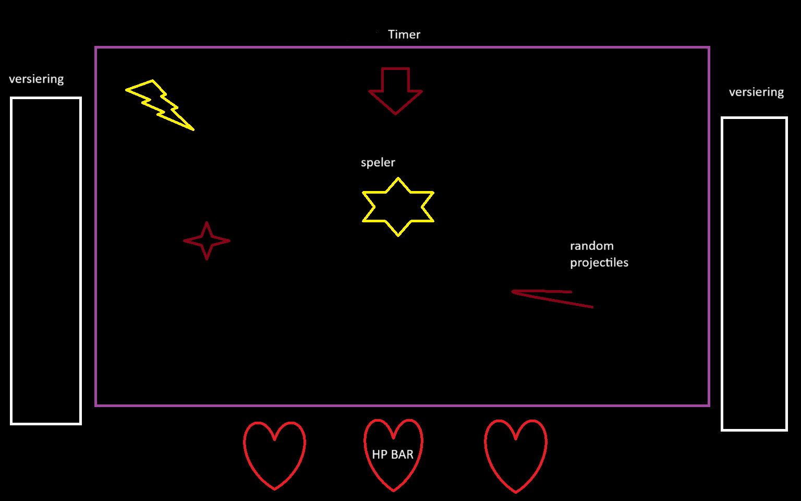

# lessen-gamedevelopment
## Mijn aanpassing
- README bijgewerkt op <24-11-2025>

Conceptschets
Titel: Dodge simulator

Genre: survival.

Beschrijving
De speler probeert alle projectiles te dodgen die op hem afgevuurt word, het doel is om zo lang mogelijk te blijven leven.

Gameplaykern
projectiles: random projectiles, kunnen ook uiteindelijk memes worden.
Targets / bumps: muren/andere projectiles
score: zolang mogelijk blijven leven, een timer die de tijd bijhoud.
Doel: blijf zolang mogelijk leven
Stijl en sfeer
Kleurrijk, willekeurige projectiles, meme culture

Structuur van het level
Bovenaan: timer
Midden: start speler
Onderaan: levens/power ups.

## Conceptschets

